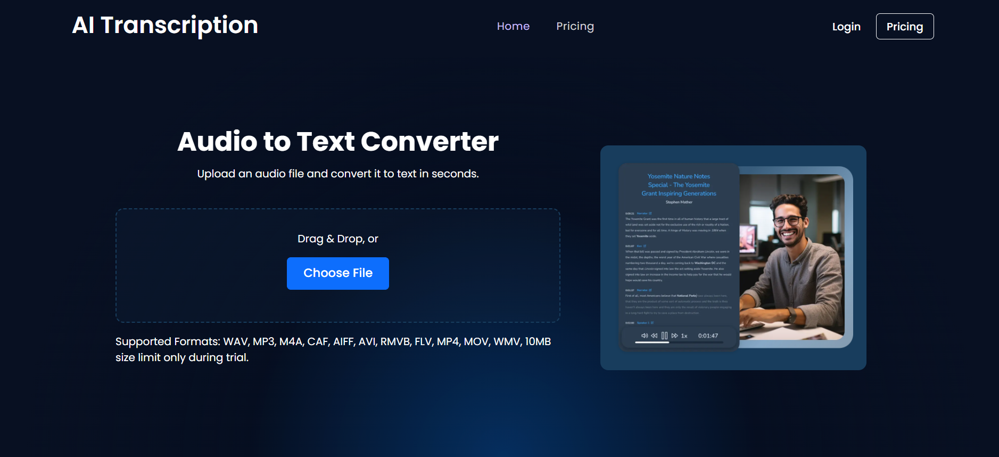
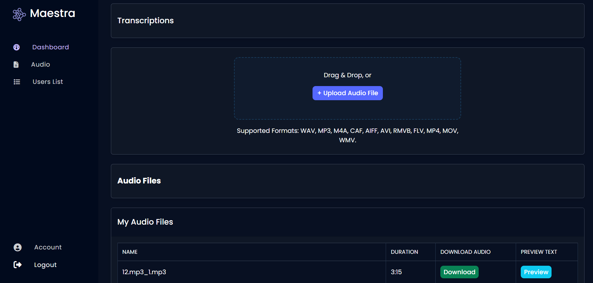

# 🎙 AI Transcription Tool

A web application that allows users to upload audio and instantly convert speech into text using AI-powered speech recognition. Users can view, edit, and download transcripts, making it easy to repurpose spoken content for documents, captions, or notes.

# 🚀 Features

Upload audio in multiple formats

Automatic transcription using AI-based speech recognition

Download transcripts in text format

Responsive design for seamless use on desktop and mobile devices

Secure file handling and efficient processing

Admin and User Dashboard

# 🛠 Tech Stack

Frontend: React.js

Backend: Python (FastAPI/Flask), Speech Recognition APIs/Models

# Home Page Design

# Admin Dashboard

